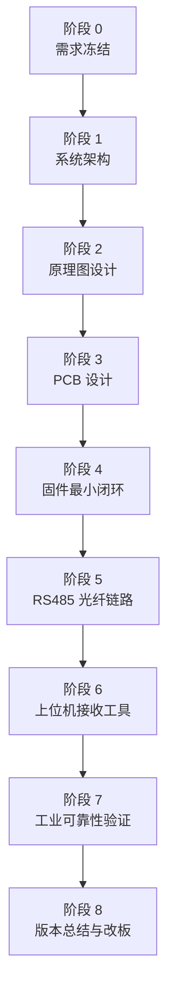

# 工业级 SLAM 数据采样打包板卡任务书

## 1. 项目定位

本项目目标是设计一块工业级 SLAM 数据采样与打包前端板卡。板卡不负责执行 SLAM 算法，也不负责处理原始图像。它的核心任务是把现场传感器数据稳定、准确、带时间戳地采集下来，打包后通过 RS485 转光纤链路传输到后端处理单元。

项目一句话定义：

```text
工业现场多源数据采样前端 + 统一时间戳 + 可靠协议打包 + RS485 光纤传输
```

本项目必须优先保证：

- 采样稳定。
- 时间戳可信。
- 通信可靠。
- 接口抗干扰。
- 故障可诊断。
- 后期可校准、可测试、可维护。

## 2. 第一版边界

第一版不要做大而全，先做一个能跑通工业数据链路的最小闭环。

### 2.1 第一版要做

| 模块 | 第一版目标 |
| --- | --- |
| 主控 | STM32F407 继续验证，正式版预留 STM32H7 方向 |
| 模拟输入 | 4 路或 8 路，先固定 0-3.3V 或 0-10V 一种量程 |
| 数字输入 | 4 路或 8 路，支持边沿采集和时间戳 |
| IMU | 板载 IMU660RC 或同类 IMU |
| 环境传感器 | 温湿度/气压任选 1-2 类 |
| 通信 | 隔离 RS485，外接 RS485 转光纤 |
| 协议 | 帧头、类型、序号、时间戳、长度、payload、CRC |
| 上位机 | Python 接收、校验、保存 CSV/二进制日志 |
| 诊断 | 心跳、错误码、丢包计数、CRC 错误计数 |

### 2.2 第一版不要做

- 不做板上 SLAM 计算。
- 不传输原始摄像头图像。
- 不一次性支持所有模拟量程。
- 不追求完整工业认证。
- 不做复杂 UI。
- 不做过早的外壳和量产结构设计。

## 3. 工业级设计原则

新手最容易犯的错是只关心“功能能不能跑”。工业项目更关心“长期现场运行会不会坏，坏了能不能定位”。

本项目必须按以下原则推进：

1. 先定义指标，再画原理图。
2. 先跑通最小闭环，再扩展通道数量。
3. 先保证数据可信，再追求采样率。
4. 所有外部接口都要有保护。
5. 所有关键数据都要有时间戳。
6. 所有通信帧都要有序号和 CRC。
7. 所有故障都要能被记录和上报。
8. 每个版本都要有验收标准。

## 4. 阶段任务总览



## 5. 阶段 0：需求冻结

### 5.1 任务目标

把模糊想法变成明确指标。没有指标就不要开始画板。

### 5.2 需要确定的问题

| 问题 | 第一版建议 |
| --- | --- |
| 模拟输入几路 | 4 路起步，最多 8 路 |
| 模拟输入量程 | 先固定一种，如 0-10V |
| 模拟采样率 | 先 1 kSPS/通道 |
| ADC 分辨率 | 12 bit 可验证，工业版建议 16 bit |
| 数字输入几路 | 4-8 路 |
| 数字输入电平 | 先 3.3V/5V，工业版扩展 12V/24V |
| IMU 采样率 | 100-500 Hz 起步 |
| 环境采样率 | 1 Hz |
| 主链路 | RS485 转光纤 |
| 通信波特率 | 115200 起步，验证后提升到 460800/921600 |
| 时间戳精度 | 第一版 1 ms，后续提升到 100 us 或更好 |

### 5.3 交付物

- 《需求指标表》
- 《接口清单》
- 《第一版不做事项清单》

### 5.4 验收标准

- 每个输入输出接口都有数量、电平、频率或采样率。
- 每个功能都能判断“完成/未完成”。
- 没有“以后再说”的关键指标。

## 6. 阶段 1：系统架构设计

### 6.1 任务目标

确定板卡整体架构，避免后期推倒重来。

### 6.2 推荐架构

```text
模拟/数字/IMU/环境传感器
        |
        v
实时采样 MCU
        |
        v
时间戳 + 缓存 + 协议打包
        |
        v
隔离 RS485
        |
        v
RS485 转光纤
        |
        v
后端 SLAM/融合/存储处理单元
```

### 6.3 关键设计决定

- MCU 第一版可以继续 STM32F407，正式工业版建议 STM32H743/H723。
- 模拟采样建议逐步从 MCU 内部 ADC 过渡到外置 16 bit ADC。
- 通信链路必须使用隔离 RS485。
- 后端处理单元负责 SLAM，前端板只负责采样和打包。

### 6.4 交付物

- 《系统框图》
- 《数据流图》
- 《主控与外设选型表》
- 《通信链路说明》

### 6.5 验收标准

- 能清楚说明每个模块负责什么。
- 能清楚说明哪些数据走 RS485 光纤。
- 能清楚说明哪些数据不应该走这块板卡。

## 7. 阶段 2：原理图设计

### 7.1 任务目标

完成第一版可打样的硬件原理图。

### 7.2 原理图模块

| 模块 | 设计要求 |
| --- | --- |
| 电源输入 | 12V 输入起步，预留 9-36V 工业宽压方向 |
| 防护 | 保险丝/自恢复保险、TVS、防反接 |
| MCU | SWD、复位、时钟、启动配置、调试串口 |
| 模拟输入 | 保护、滤波、量程转换、ADC 输入 |
| 数字输入 | 限流、滤波、施密特/隔离、GPIO/定时器输入 |
| IMU | SPI/I2C、数据就绪中断、独立干净供电 |
| 环境传感器 | I2C/SPI/UART 接口，远离发热源 |
| RS485 | 隔离收发器、TVS、终端电阻、偏置电阻、DE/RE 控制 |
| 存储 | SPI Flash/FRAM 可选，用于日志和缓存 |
| 指示灯 | 电源、运行、通信、错误、链路状态 |
| 测试点 | 电源轨、ADC 输入、RS485 TX/RX、同步信号、复位 |

### 7.3 工业级注意事项

- 所有外部接口必须有 ESD/TVS 保护。
- RS485 最好做电源隔离和信号隔离。
- 模拟地和数字地要规划，不要随便一整片乱铺。
- ADC 参考源和模拟电源要干净。
- IMU 要远离 DC/DC、电感、大电流和高速信号。
- 每个重要电源轨都要有测试点。

### 7.4 交付物

- 原理图 PDF。
- 关键器件 BOM。
- 接口定义表。
- 电源树。
- 测试点清单。

### 7.5 验收标准

- 每个外部接口都有保护。
- 每个芯片电源脚都有去耦电容。
- SWD、串口、复位、启动脚可调试。
- RS485 有隔离、防护、端接和方向控制。
- 模拟输入不会因正常工业信号直接烧毁 ADC。

## 8. 阶段 3：PCB 设计

### 8.1 任务目标

完成可打样 PCB，重点保证抗干扰、可调试和可生产。

### 8.2 布局规则

- 电源入口、保护器件、DC/DC 靠近输入端。
- 模拟输入端子、保护、滤波、ADC 靠近放置。
- RS485 接口、TVS、隔离器靠近连接器。
- MCU 放在中心区域，方便连接 ADC、IMU、RS485。
- IMU 放在机械稳定区域，丝印标注 X/Y/Z 轴。
- 数字隔离区和非隔离区要有清晰边界。
- 测试点要能被探针或万用表接触。

### 8.3 走线规则

- RS485 A/B 差分线尽量短、平行、等长。
- 模拟输入远离 DC/DC、电感、晶振、高速数字线。
- ADC 参考源走线短、干净，避免穿越数字区。
- 大电流电源线加宽。
- 地回流路径要连续。
- 隔离区域注意爬电距离和电气间隙。

### 8.4 交付物

- PCB Gerber。
- 坐标文件。
- BOM。
- 装配图。
- PCB 设计说明。

### 8.5 验收标准

- DRC 无错误。
- 外部接口方向和丝印清晰。
- 所有测试点可访问。
- 模拟区、数字区、隔离区分区明确。
- 关键器件封装经过核对。

## 9. 阶段 4：固件最小闭环

### 9.1 任务目标

让板卡能稳定采样、打包、输出，不追求复杂功能。

### 9.2 固件任务

| 模块 | 任务 |
| --- | --- |
| BSP | ADC、GPIO、IMU、RS485、定时器、存储 |
| Services | 采样缓存、协议编码、诊断统计 |
| Application | 状态机、周期调度、命令处理 |
| Protocol | 帧头、类型、序号、时间戳、长度、CRC |

### 9.3 必须实现的帧类型

| 帧类型 | 内容 |
| --- | --- |
| HEARTBEAT | 设备状态、版本号、运行时间 |
| IMU_SAMPLE | 角速度、加速度、温度、时间戳 |
| ADC_SAMPLE/ADC_BLOCK | 通道号、采样值、采样时间 |
| DIGITAL_EVENT | 输入通道、边沿、计数、时间戳 |
| ENV_SAMPLE | 温度、湿度、气压等 |
| ERROR_REPORT | 错误码、错误计数、最近故障 |
| LINK_STATS | 发送计数、CRC 错误、丢包、重发 |

### 9.4 工业级要求

- 不允许高频采样路径里阻塞串口发送。
- 所有发送数据都必须带序号。
- 所有重要事件都必须带时间戳。
- 所有错误都必须能查询。
- 看门狗必须规划。
- 版本号必须能上报。

### 9.5 交付物

- 固件源码。
- 协议说明文档。
- 串口/RS485 测试日志。
- 最小闭环演示记录。

### 9.6 验收标准

- 连续运行 2 小时不死机。
- IMU、ADC、数字输入至少各能输出一种有效数据帧。
- 后端能识别帧序号和 CRC。
- 拔掉传感器或制造错误时，设备能上报错误而不是静默失败。

## 10. 阶段 5：RS485 转光纤链路

### 10.1 任务目标

验证主通信链路可靠性。

### 10.2 测试内容

- 115200 bps 稳定通信。
- 460800 bps 稳定通信。
- 921600 bps 可行性测试。
- 长时间连续发送。
- 光纤断开后恢复。
- 后端掉电后恢复。
- CRC 错误统计。
- 丢包统计。
- 心跳超时检测。

### 10.3 协议要求

每帧至少包含：

```text
帧头 | 版本 | 类型 | 序号 | 时间戳 | 长度 | Payload | CRC
```

推荐增加：

- 设备 ID。
- 帧标志位。
- 采样批次号。
- 链路状态。
- 可选 ACK/NACK。

### 10.4 交付物

- RS485 光纤链路测试报告。
- 最大稳定波特率记录。
- 丢包率记录。
- 断链恢复记录。

### 10.5 验收标准

- 目标波特率下连续运行 8 小时。
- 后端能检测丢包。
- 断链恢复后系统不死机。
- 心跳异常能被上报。

## 11. 阶段 6：上位机接收工具

### 11.1 任务目标

做一个简单但靠谱的 Python 工具，用于接收、校验、保存和回放数据。

### 11.2 功能要求

- 打开串口。
- 自动寻找帧头。
- 校验 CRC。
- 检查序号连续性。
- 统计丢包、错包、速率。
- 保存原始二进制日志。
- 导出 CSV。
- 简单实时曲线显示 ADC/IMU 数据。

### 11.3 交付物

- Python 接收脚本。
- CSV 示例数据。
- 二进制日志示例。
- 使用说明。

### 11.4 验收标准

- 能连续接收 1 小时不崩溃。
- 能发现 CRC 错误。
- 能发现序号跳变。
- 能把 ADC 和 IMU 数据导出成 CSV。

## 12. 阶段 7：工业可靠性验证

### 12.1 任务目标

从“能跑”升级到“现场更不容易出事”。

### 12.2 基础测试

| 测试 | 目标 |
| --- | --- |
| 连续运行 | 24 小时起步 |
| 上电/断电循环 | 100 次 |
| RS485 断链恢复 | 100 次 |
| 输入过压保护 | 按设计范围测试 |
| 电源波动 | 额定电压上下浮动 |
| 温升 | 记录主要芯片温度 |
| 噪声测试 | ADC 空载噪声、短接噪声 |
| 边沿输入 | 数字输入频率和抖动测试 |

### 12.3 EMC 预备测试

第一版不一定做正式认证，但设计和测试要向这些标准靠拢：

- ESD：IEC 61000-4-2。
- EFT：IEC 61000-4-4。
- Surge：IEC 61000-4-5。
- 传导骚扰和辐射骚扰预扫。

### 12.4 交付物

- 可靠性测试记录。
- 问题清单。
- 改板建议。
- 风险等级表。

### 12.5 验收标准

- 连续运行无死机。
- 断链恢复正常。
- 错误计数能正确记录。
- 主要发热器件温度在安全范围内。
- 发现的问题都有处理建议。

## 13. 阶段 8：版本总结与改板

### 13.1 任务目标

把样机问题变成下一版明确修改项。

### 13.2 总结内容

- 哪些功能完成。
- 哪些功能未完成。
- 哪些电路需要修改。
- 哪些器件选型不合适。
- 哪些接口需要调整。
- 哪些测试没有通过。
- 下一版必须增加哪些测试点。

### 13.3 交付物

- V0.1 总结报告。
- V0.2 改板任务书。
- 更新后的原理图修改清单。
- 更新后的固件任务清单。

### 13.4 验收标准

- 每个问题都有原因分析。
- 每个修改项都有责任模块。
- 下一版目标明确，不继续发散。

## 14. 推荐器件方向

### 14.1 主控

| 芯片 | 适合阶段 | 说明 |
| --- | --- | --- |
| STM32F407 | 当前验证 | 能快速跑通基础链路 |
| STM32H743/H723 | 工业正式版 | 性能、DMA、缓存和外设资源更充足 |
| NXP i.MX RT1170 | 高性能版本 | 适合更复杂协议和更高吞吐 |

### 14.2 ADC

| 芯片 | 适用场景 |
| --- | --- |
| STM32 内部 ADC | 原型验证、低成本辅助采样 |
| AD7606B | 多通道同步采样、工业 ±10V |
| ADS8688 | 多量程工业模拟输入 |

### 14.3 通信

| 器件类型 | 要求 |
| --- | --- |
| RS485 收发器 | 工业级、失效保护、ESD 强 |
| 数字隔离器 | 隔离 MCU 与现场总线 |
| 隔离电源 | 给隔离侧 RS485 供电 |
| RS485 转光纤模块 | 工业温度、宽压、状态指示 |

## 15. 新手执行建议

### 15.1 每周节奏

每周只解决一类问题：

- 第 1 周：需求表和接口表。
- 第 2 周：系统框图和器件选型。
- 第 3-4 周：原理图。
- 第 5 周：PCB。
- 第 6-7 周：固件最小闭环。
- 第 8 周：RS485 光纤链路。
- 第 9 周：上位机工具。
- 第 10 周：连续运行和问题总结。

### 15.2 不要跳过的工作

- 画接口表。
- 写协议文档。
- 记录测试数据。
- 做错误码。
- 做状态灯。
- 做测试点。
- 做版本号。
- 做丢包统计。

### 15.3 最容易翻车的地方

- 模拟输入保护不足。
- RS485 没隔离。
- 通信没有 CRC。
- 数据没有序号。
- 时间戳不统一。
- 高频采样时阻塞发送。
- 没有上位机接收工具。
- 没有测试记录。

## 16. 第一版完成定义

只有满足以下条件，才算第一版完成：

- 板卡能稳定上电。
- MCU 能正常运行并上报版本和心跳。
- IMU 能输出有效数据。
- 至少 4 路模拟输入能采样。
- 至少 4 路数字输入能捕获事件。
- 数据能通过 RS485 转光纤传到后端。
- 后端工具能校验 CRC 和序号。
- 能保存日志文件。
- 连续运行 8 小时不死机。
- 出现传感器异常或链路异常时能上报错误。

## 17. 最终目标

最终产品应从一个普通采集板变成工业级 SLAM 数据前端设备：

- 能长期运行。
- 能抗现场干扰。
- 能判断自身状态。
- 能发现链路异常。
- 能给后端提供可信时间戳。
- 能让后端 SLAM 系统拿到干净、连续、可追溯的数据。

工业级不是“功能多”，而是“现场出了问题还能知道为什么，并且尽量不中断关键数据链路”。
